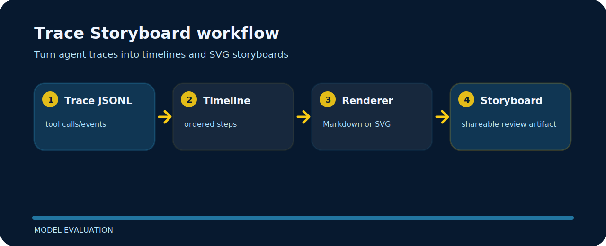

# Trace Storyboard


This project is a small, inspectable model evaluation tool. It prefers concrete examples and local files over hidden setup.

## Visual route



## Try the sample

```bash
git clone https://github.com/mertefekurt/trace-storyboard.git
cd trace-storyboard
python -m pip install -e ".[dev]"
trace-storyboard examples/agent-trace.jsonl
trace-storyboard examples/agent-trace.jsonl --format svg --output trace.svg
```

## Reading notes

The project stays useful because of these small constraints:

- Markdown works for PR comments.
- SVG works for visual handoffs.
- The trace stays local.

## Maintenance rhythm

```bash
ruff check .
pytest
python -m trace_storyboard --help
```
