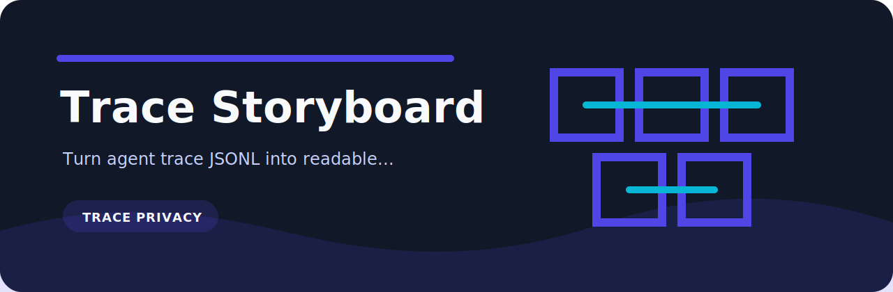

# Trace Storyboard

   

Turn agent trace JSONL into readable timelines and SVG storyboards.

## Read this first

This is a compact tool, not a platform. The useful part is the repeatable check and the plain output, so the repository keeps setup and code paths short.

## First run

```bash
python -m pip install -e ".[dev]"
trace-storyboard examples/agent-trace.jsonl
```

## Maintenance

```bash
python -m pip install -e ".[dev]"
ruff check .
pytest
python -m trace_storyboard --help
```

## Repository map

```text
.github/        CI workflow
examples/       sample inputs
src/            package source
tests/          test coverage
.gitignore      project file
pyproject.toml  package metadata
```
