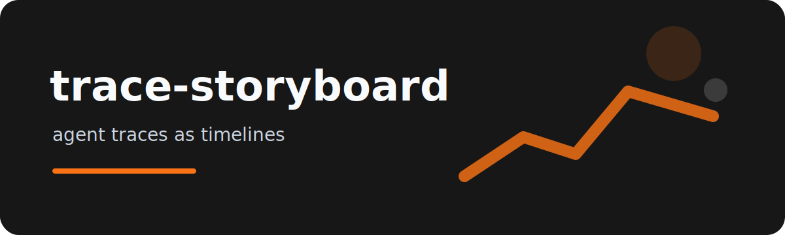

<p align="center"></p>

# trace-storyboard

Agent traces are useful, but raw JSONL is hard to read in a review. `trace-storyboard` turns each event into
a compact timeline and can also emit a simple SVG artifact for PRs or incident notes.

```
trace-storyboard examples/agent-trace.jsonl --format markdown
trace-storyboard examples/agent-trace.jsonl --format svg --output trace.svg
```

## Event shape

```json
{"time":"2026-07-03T10:00:00Z","actor":"planner","action":"select_tool","message":"search docs","latency_ms":340}
```

Missing fields are tolerated. The renderer keeps enough structure to answer three questions quickly:

- who acted
- what changed
- where latency accumulated

## Review use

Paste the Markdown output into a PR comment, or attach the SVG when explaining an agent failure path. The
project is deliberately offline and deterministic, so traces can be reviewed without sending them to another
service.

## Checks

`ruff check .`, `pytest`, and `python -m trace_storyboard --help` cover the CLI and renderers.

License: MIT.
